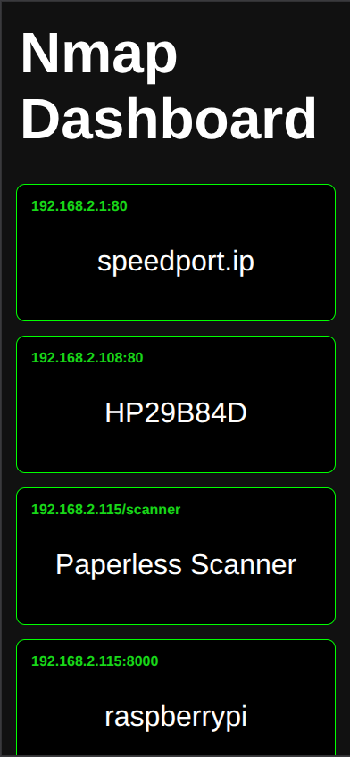
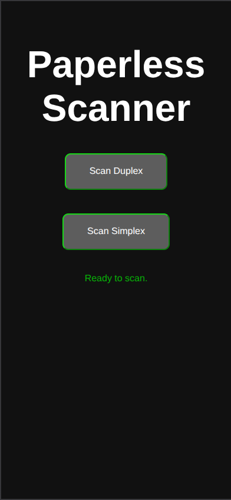

# Nmap Dashboard and Scanning integration

This project is a simple dashboard for monitoring devices on my local network. It also integrates with the scanner unit of my **HP ENVY PHOTO 7830**, letting me scan documents directly to my Paperless instance. Scan requests can also be sent from an ESP-based "instant-scan" button. This makes it convenient for skipping the printer’s clunky menu and streamlines the integration into paperless.

The dashboard is especially useful if your network often has new or changing devices. Every time you open it, an **Nmap scan** runs to detect open ports. Each open port is shown as a clickable box that forwards you to the corresponding device or service.

The website works well on both phones and desktops.

    
    

